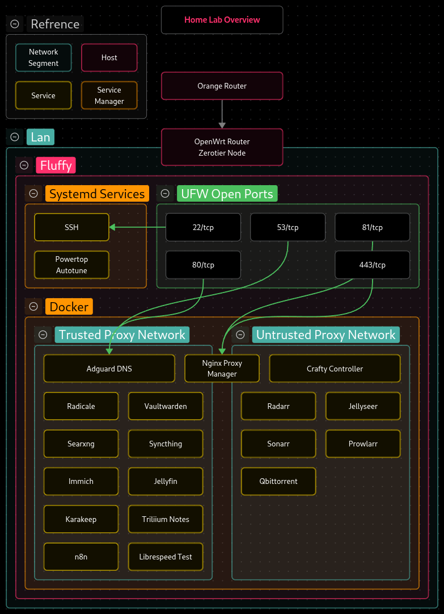

# Homelab

This repository contains Docker Compose configurations for all self-hosted services running in my homelab.

## Overview

Services are containerized and managed independently via Docker Compose, exposed through a reverse proxy with TLS termination and DNS-based routing.

## Network Architecture

| Property | Value |
|----------|-------|
| Docker networks | `trusted_proxy`, `untrusted_proxy` |

All services are reachable via Nginx Proxy Manager using a subdomain and a valid SSL certificate. The network is segmented into two Docker bridge networks, both connected to the reverse proxy:

- **trusted_proxy** — services that handle personal or sensitive data
- **untrusted_proxy** — services that increase the threat surface or are not fully trusted



## Services

| Service | Purpose | Network |
|---------|---------|---------|
| AdGuard Home | DNS filtering and ad blocking | trusted |
| Nginx Proxy Manager | Reverse proxy and TLS termination | trusted, untrusted |
| Immich | Photo and video management | trusted |
| Vaultwarden | Password manager (Bitwarden-compatible) | trusted |
| Syncthing | Peer-to-peer file synchronization | trusted |
| Radicale | CalDAV and CardDAV server | trusted |
| Trilium Notes | Hierarchical note-taking | trusted |
| n8n | Workflow automation | trusted |
| Jellyfin | Media streaming server | trusted |
| SearXNG | Privacy-respecting metasearch engine | trusted |
| Karakeep | Bookmark and read-it-later manager | trusted |
| Librespeed | Self-hosted speed test | trusted |
| Servarr | Media automation stack (Radarr, Sonarr, Prowlarr, Jellyseer, Qbittorrent) | untrusted |
| Crafty Controller | Minecraft server management | untrusted |

Each service is self-contained. Configuration, volumes, and environment variables are defined within each service directory. Services within the same Docker Compose file communicate over the default network created automatically by Docker Compose. Cross-service communication, where needed, goes through the shared `trusted-proxy` or `untrusted-proxy` networks, both of which are attached to Nginx Proxy Manager.

## Deployment

Create the env file required by the services and then

```bash
cd apps/<service>
docker compose up -d
```

Or from the repository root:

```bash
docker compose -f apps/<service>/compose.yaml up -d
```

## Environment Variables

Most services require a `.env` file in the service directory. Refer to the README adjacent to each service for its specific requirements. A typical `.env` looks like:

```env
PUID=1000
PGID=1000
TIMEZONE=UTC
```

## Backups

Docker volumes are backed up regularly using
[offen/docker-volume-backup](https://github.com/offen/docker-volume-backup),
which runs as a sidecar container and handles scheduled, compressed backups
of container volumes with minimal configuration.

For static data such as media libraries and configuration files,
[Duplicati](https://www.duplicati.com) is planned as the backup solution,
offering encrypted, deduplicated backups to a remote or local destination.